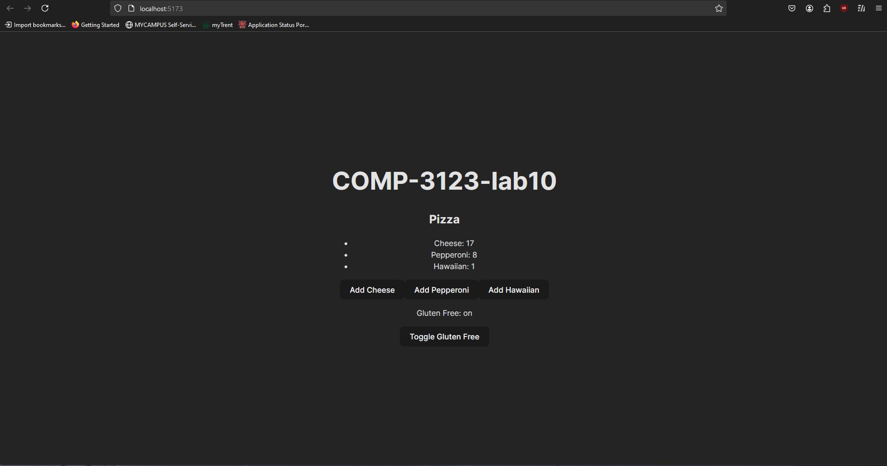

# 101448926_COMP3123_lab10
# React + Vite

This template provides a minimal setup to get React working in Vite with HMR and some ESLint rules.

this application is all about redux concepts.

REDUX concepts covered in this application:
State: The pizza counts and other application state are tracked in the Redux store.
Store: The store is configured with the pizza reducer, managing the application state.
Reducer: The reducer handles actions like adding pizzas and toggling gluten-free status.
Action: Actions like addPizza and toggleGlutenFree are dispatched from the components.
Dispatch: Dispatch is used to send actions to the Redux store, updating the state.
Subscribe: useSelector is used to subscribe to state changes and automatically re-render the component when state changes.

# SCREENSHOT:

